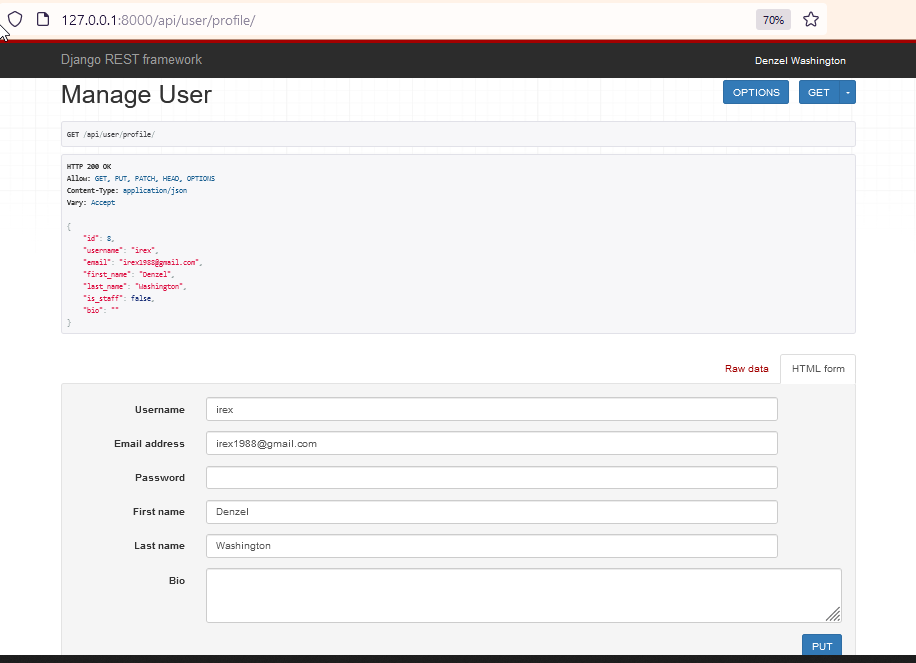
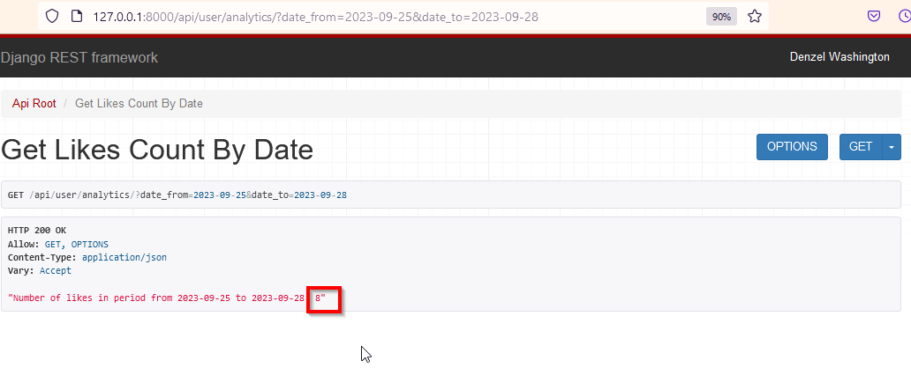

# StarNavi Test Task - Social Media API

API service for managing social media with DRF. 
Implemented possibility of creating users, creating posts, like/dislike posts.
Also added analytics for likes, and activity for users.

## Installation

Python 3 should be installed. Docker should be installed.

    https://github.com/Oomamchur/StarNavi_test_task
    cd StarNavi_test_task
    python -m venv venv
    source venv\Scripts\activate - on Windows
    source venv/bin/activate - on macOS or Linux
    pip install -r requirements.txt
    python manage.py migrate    
    python manage.py runserver

This project uses environment variables to store sensitive information such as the Django secret key and database credentials.
Create a `.env` file in the root directory of your project and add your environment variables to it. This file should not be committed to the repository.
You can see the example in `.env.sample` file.

## Getting access
Use the following command to load prepared data from fixture to test and debug your code:

    python manage.py loaddata fixture_data.json

After loading data from fixture you can use user (or create another one by yourself):

    Login: admin
    Password: Admin123

    create user via /api/user/register/
    get access token via /api/user/token/

Also, you can run automated bot for checking functionality of the system. 
You can write your values in config.ini or use the default values.
    
    python manage.py automated_bot

## Features

1. Admin panel.
2. Managing own profile.
3. Filtering users by username, first name, last name.
4. Creating posts with adding images.
5. Possibility to like/dislike posts.
6. Analytics for likes.
7. Activity for authenticated user.
8. Added different permissions for different actions.
9. JWT authenticated.
10. Documentation located at /api/doc/swagger/
11. Automated bot via Django commands.

## Demo

